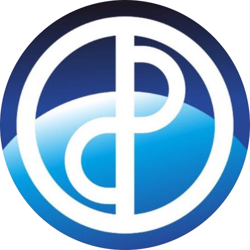

  <h1>KIT</h1>
  

* _Standart_        : ERC20
* _Name_            : KIT
* _Ticket_          : KIT
* _Decimals_        : 18
* _Emission_        : Mintable
* _Crowdsales_      : 2
* _Fiat dependency_ : No
* _Tokens locked_   : Locked

## Smart-contracts description

Contract mint bounty, advisors and founders tokens after each stage finished. 
Crowdsale contracts have special function to retrieve transferred in errors tokens.

### Contracts 
1. _KITToken_ - 
2. _Presale_ - 
3. _ICO_ - 
4. _Deployer_ - 

### How to manage contract
To start working with contract you should follow next steps:
1. Compile it in Remix with enamble optimization flag and compiler 0.4.18
2. Deploy bytecode with MyEtherWallet. Gas 5100000 (actually 5019453).
3. Call 'deploy' function on addres from (3). Gas 4000000 (actually 3979551). 

You can withdraw coins from presale at any time after softcap reached. You should call function _withdraw_ to do this. 
All coins from presale transferred to special eth wallet, which specified in presale configuration.

After each crowdsale stage contract manager must call finishMinting. 

If softcap not reached investors can retrieve coins by calling refund after presale finished.

### How to invest
To purchase tokens investor should send ETH (more than minimum 0.1 EHT) to corresponding crowdsale contract.
Recommended GAS: 200000, GAS PRICE - 21 Gwei.

### Wallets with ERC20 support
1. MyEtherWallet - https://www.myetherwallet.com/
2. Parity 
3. Mist/Ethereum wallet

EXODUS not support ERC20, but have way to export key into MyEtherWallet - http://support.exodus.io/article/128-how-do-i-receive-unsupported-erc20-tokens

Investor must not use other wallets, coinmarkets or stocks. Can lose money.

## Main network configuration

### Crowdsale stages

#### Presale
* _Base price_                 : 1000 KIT per ETH
* _Minimal insvested limit_    : 0.01 ETH
* _Softcap_                    : 20 ETH
* _Hardcap_                    : 63 000 ETH
* _Founders_                   : 10% of total tokens
* _Bounty_                     : 3% of total tokens
* _Advisors_                   : 1% of total tokens
* _Developers_                 : 4% of total tokens
* _Start_                      : Wed, 20 Dec 2017 13:00:00 GMT 
* _End_                        : Thu, 25 Jan 2018 13:00:00 GMT
* _Founders tokens wallet_     : 
* _Bounty tokens wallet_       : 
* _Advisors tokens wallet_     : 
* _Developers tokens wallet_   : 
* _Contract manager_           : 
* _ETH Wallets_                : 

_Milestones_

1. 1 week                      : +42%
2. 1 week                      : +25%
3. 1 week                      : +11%
3. other                       : without bonus

#### ICO
* _Base price_                 : 909 KIT per ETH
* _Minimal insvested limit_    : 0.01 ETH
* _Hardcap_                    : 67 500 ETH
* _Founders_                   : 10% of total tokens
* _Bounty_                     : 3% of total tokens
* _Advisors_                   : 1% of total tokens
* _Developers_                 : 4% of total tokens
* _Start_                      : Tue, 20 Feb 2018 13:00:00 GMT 
* _End_                        : Tue, 20 Mar 2018 13:00:00 GMT
* _Founders tokens wallet_     : 
* _Bounty tokens wallet_       : 
* _Advisors tokens wallet_     : 
* _Developers tokens wallet_   : 
* _Contract manager_           : 
* _ETH Wallets_                : 

_Milestones_
1. 1 week                      : +10%
2. 1 week                      : +5%
3. other                       : base price

## Ropsten network configuration

### Crowdsale stages

#### Presale
* _Base price_                 : 1000 KIT per ETH
* _Minimal insvested limit_    : 0.01 ETH
* _Softcap_                    : 20 ETH
* _Hardcap_                    : 63 000 ETH
* _Founders_                   : 10% of total tokens
* _Bounty_                     : 3% of total tokens
* _Advisors_                   : 1% of total tokens
* _Developers_                 : 4% of total tokens
* _Start_                      : Wed, 20 Dec 2017 13:00:00 GMT
* _End_                        : Thu, 25 Jan 2018 13:00:00 GMT
* _Founders tokens wallet_     : 0xf8b4Da46E85e43c47EBbF73ac8C6746fE3d3f111
* _Bounty tokens wallet_       : 0xDa67155b22973bE05Bcd28c07107b2E17314A1e2
* _Advisors tokens wallet_     : 0xA0B1Bd7827C070F29b5aBa47e7B73FF4EfA00a57
* _Developers tokens wallet_   : 0x8f840bB49CD83Baad5a228728b2a6edAc828f446
* _Contract manager_           : 0x55dd7A6353FC004B4F6Da9855F9403B35f4530B1
* _ETH Wallets_                : 0xd89626E2c4218281Ad0Fc5F22AE52dC0FF39DDC4
* _Developers wallet_          : 0x8f840bB49CD83Baad5a228728b2a6edAc828f446

_Milestones_

1. 1 week                      : +42%
2. 1 week                      : +25%
3. 1 week                      : +11%
3. other                       : without bonus

#### ICO
* _Base price_                 : 909 KIT per ETH
* _Minimal insvested limit_    : 0.01 ETH
* _Hardcap_                    : 67 500 ETH
* _Founders_                   : 10% of total tokens
* _Bounty_                     : 3% of total tokens
* _Advisors_                   : 1% of total tokens
* _Developers_                 : 4% of total tokens
* _Start_                      : Tue, 20 Feb 2018 13:00:00 GMT 
* _End_                        : Tue, 20 Mar 2018 13:00:00 GMT
* _Founders tokens wallet_     : 0xf8b4Da46E85e43c47EBbF73ac8C6746fE3d3f111
* _Bounty tokens wallet_       : 0xDa67155b22973bE05Bcd28c07107b2E17314A1e2
* _Advisors tokens wallet_     : 0xA0B1Bd7827C070F29b5aBa47e7B73FF4EfA00a57
* _Developers tokens wallet_   : 0x8f840bB49CD83Baad5a228728b2a6edAc828f446
* _Contract manager_           : 0x55dd7A6353FC004B4F6Da9855F9403B35f4530B1
* _ETH Wallets_                : 0xd89626E2c4218281Ad0Fc5F22AE52dC0FF39DDC4
* _Developers wallet_          : 0x8f840bB49CD83Baad5a228728b2a6edAc828f446

_Milestones_
1. 1 week                      : +10%
2. 1 week                      : +5%
3. other                       : base price

#### Links
* _Token_   - https://ropsten.etherscan.io/address/0xd57bb7b1a787ff9579c4d8b3855f0deca7e9d561
* _Presale_ - https://ropsten.etherscan.io/address/0xf7361a7c0afa1143fc6a7a772741f49c8f4b0ae0
* _ICO_     - https://ropsten.etherscan.io/address/0x16d42497d1c41c90e922c5a2a23eaf52cfacbe68

